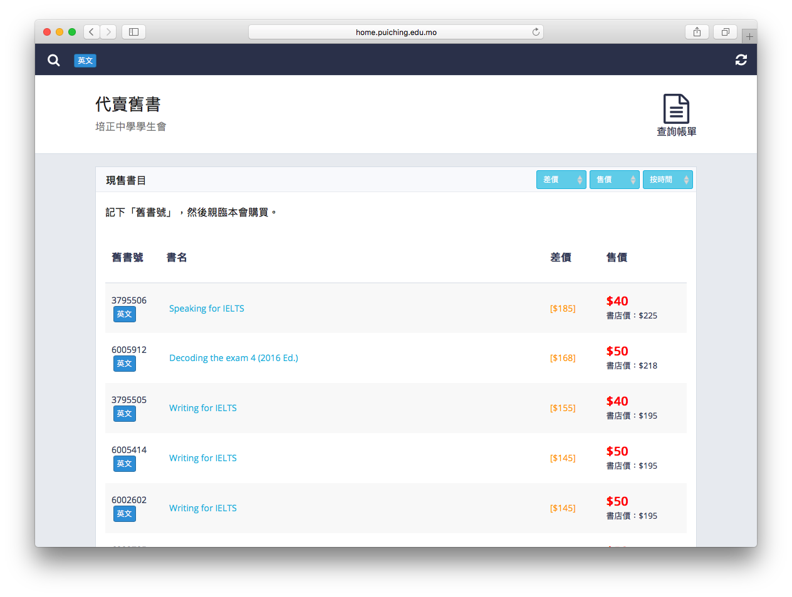
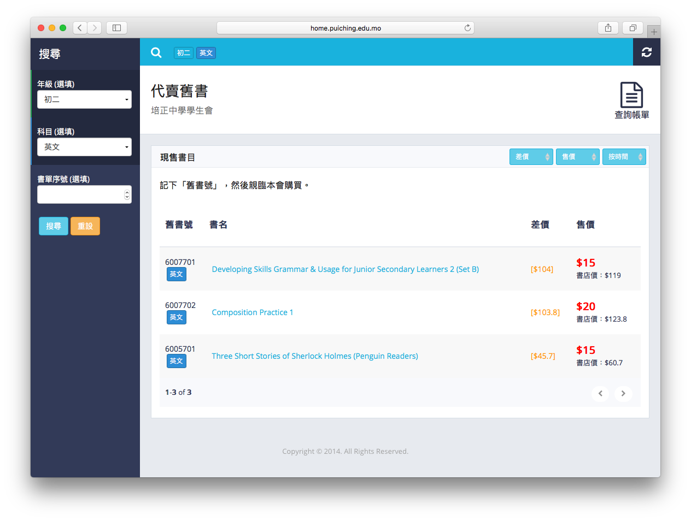
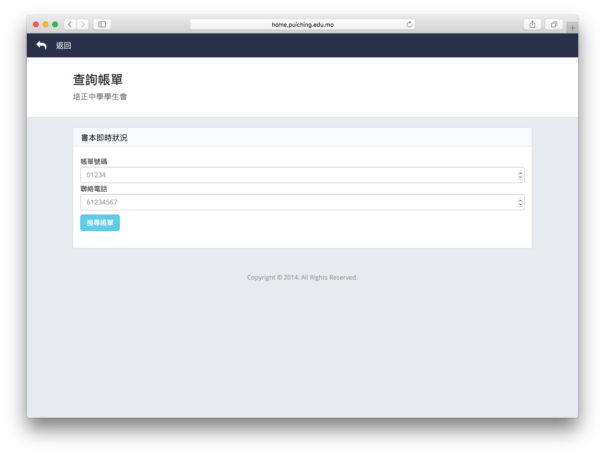
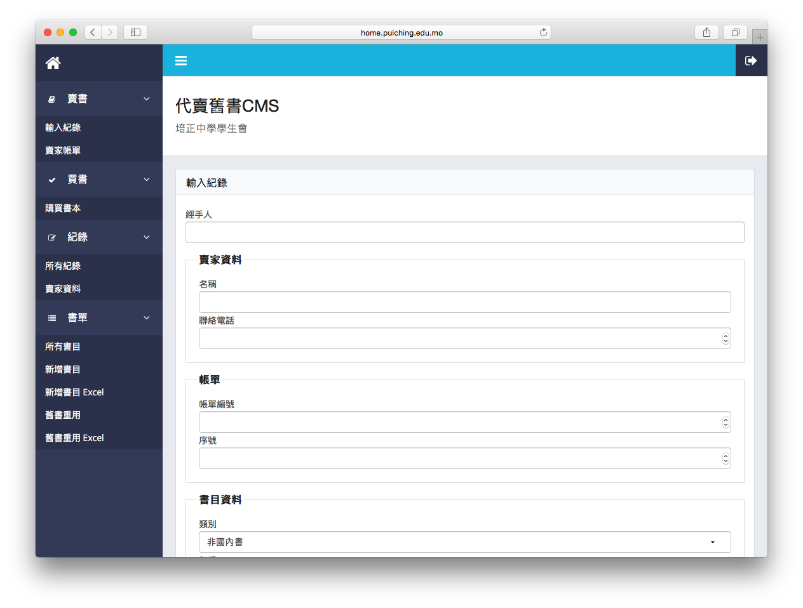
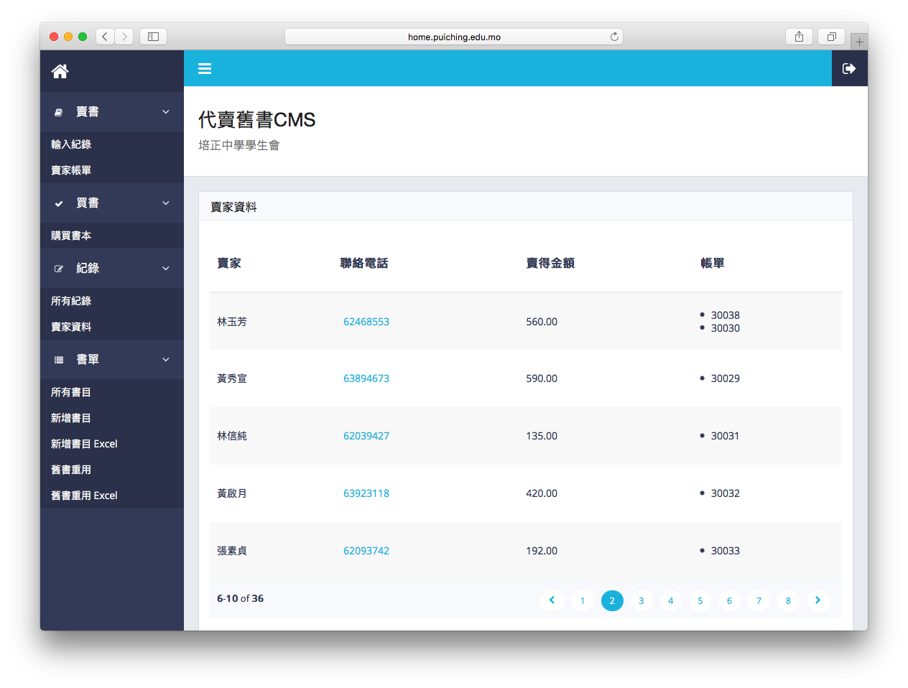
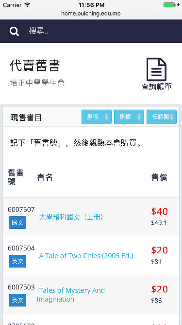
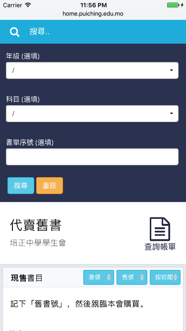

# Used Book Selling System
http://home.puiching.edu.mo/~pcmssa/book/

The Used Book Selling System is designed for sellers to list their books and buyers to find the books on sale easily. The system is currently used by Macau Pui Ching Middle School Student Association(SA). Students could bring their used books to school for sale. SA members would help the seller list the books and provide the seller a receipt with an ID, which could be used to track his/her books status online in real time.

## Home page
The home page lists all the books on sale. The list can be sorted by the price difference between new and used book, price and listed time.

## Search Listed Books
Books could be searched by grades, subjects and book ID provided by book dealer.

## Real Time Books Status
Sellers could find their books status by filling out the receipt ID and phone numbers.

## Content Management System (Login Required)
SA members could add or remove listing in CMS. The system could show each sellers' phone number and the amount of money they get from sold books.
### Add Book

### Sellers' Info
It shows each sellers' name, phone number, the amount of money and receipt ID. It helps SA members to contact the sellers and return the money.

*Note: it's dummy sellers' info*

## Mobiles
The website is designed for all mobile devices. (Left: home page; Right: search)

